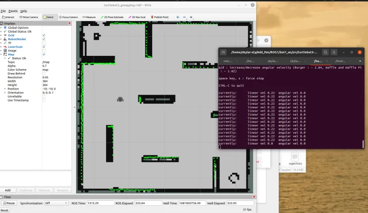
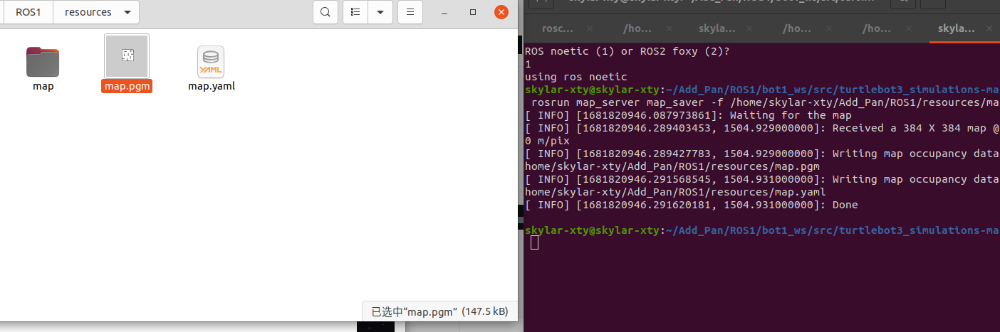
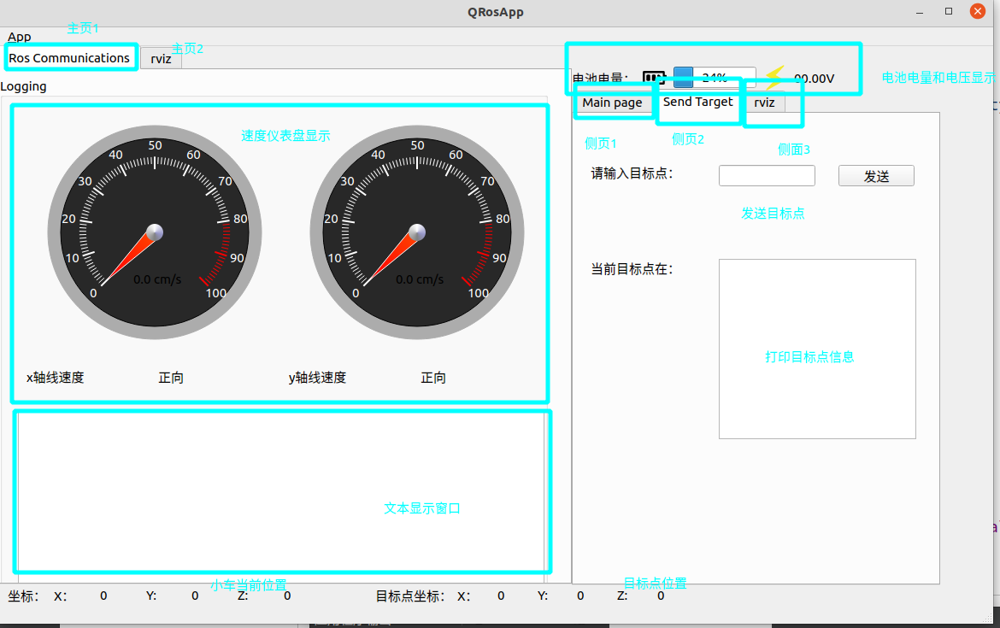
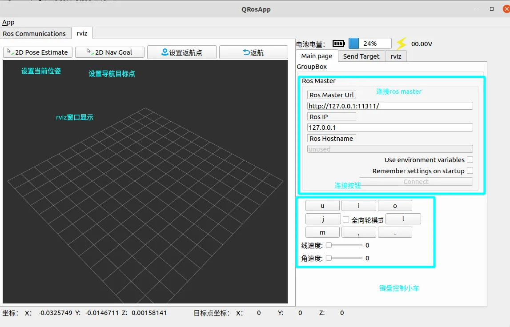
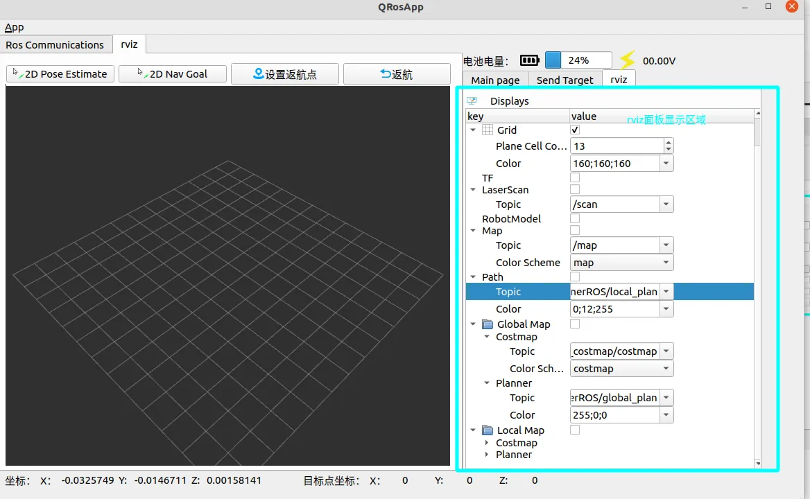
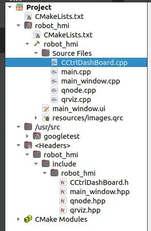

# Project Plan: TurtleBot3 and Qt Integration

## Part 1: Preparations

### 1. Install and Configure TurtleBot3 Packages
- Ensure the TurtleBot3 ROS packages are installed and correctly configured.
- Verify environment variables like `TURTLEBOT3_MODEL` are set properly.

### 2. Test the Functionality of TurtleBot3 Packages
- Explore and test the provided TurtleBot3 functionalities:
  - Launch different `world` files.
  - Use various `launch` files to start the simulation.
  - Control the robot using the keyboard (`teleop`).

### 3. Map Preparation
- Choose a suitable `world` file for mapping.
- Perform mapping using SLAM or other mapping methods.
- Save the generated map using the `map_server`.

### 4. Resolve Errors
- Debug and fix any errors encountered during installation, configuration, or operation of TurtleBot3 packages.

---

## Part 2: Qt Program Development

### 1. UI Design
- Create a graphical user interface (GUI) for the application using Qt Designer or custom code.
- Ensure the interface is user-friendly and intuitive.
  

### 2. Integration with RViz
- Enable interaction between the GUI and RViz for visualization and robot control.

#### Code Directory Overview:

1. **`CCtrlDashBoard.cpp/.h`**:
   - Open-source speed dashboard program.
   - Handles the graphical representation of the robot's speed and direction.

2. **`qnode.cpp/.hpp`**:
   - Core ROS node design.
   - Responsible for publishing and subscribing to ROS topics.
   - Handles ROS node initialization and communication.

3. **`qrviz.cpp/.hpp`**:
   - Focused on RViz development and customization.
   - Integrates RViz visualization into the Qt application.

4. **`main.cpp`, `main_window.cpp/.hpp`**:
   - Manage the overall application logic and user interface.
   - Define slots, signals, and text processing for seamless interaction.

---

## Next Steps
- Begin by setting up the TurtleBot3 environment and ensure all dependencies are resolved.
- Progress to UI design in Qt and establish integration with ROS topics and RViz visualization.
- Test the application iteratively to ensure robust functionality.
